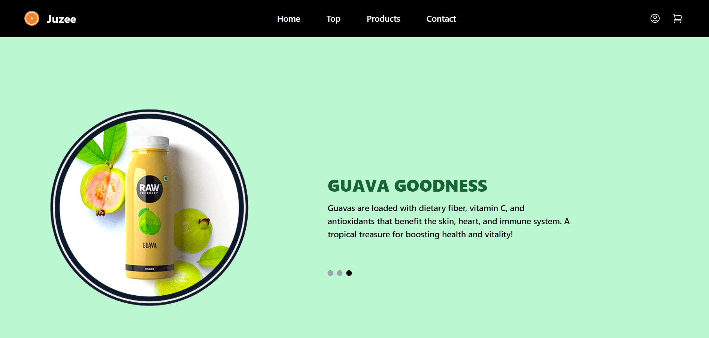

🍊 Juzee - Fresh Juice Website

Juzee is a modern, responsive juice product website built with React.js.
The goal of the project is to create a clean, engaging user interface for browsing and selecting from a variety of juice products, 
with seamless navigation and a dynamic product catalogue.

This project demonstrates key React skills such as state management, component-driven architecture, 
and smooth navigation using React Scroll. It's perfect for showcasing front-end development abilities.

🚀 Live Demo
Live Demo URL – https://juzee-react.vercel.app/

📌 Features
Product Catalog: Dynamic catalog of juices, shakes, and other beverages, powered by React state and map() functions.
Responsive Design: Built with Tailwind CSS to ensure a smooth experience across devices from mobile to desktop.
Smooth Navigation: Implemented React Scroll for smooth scrolling between sections.
Interactive Components: Clickable elements for selecting different products and viewing their details.
Reusable Components: Modular structure with reusable components like the Navbar, Footer, Product Cards, etc.
Clean UI/UX: Minimalistic, clean, and user-friendly design with rich visuals of the products.
